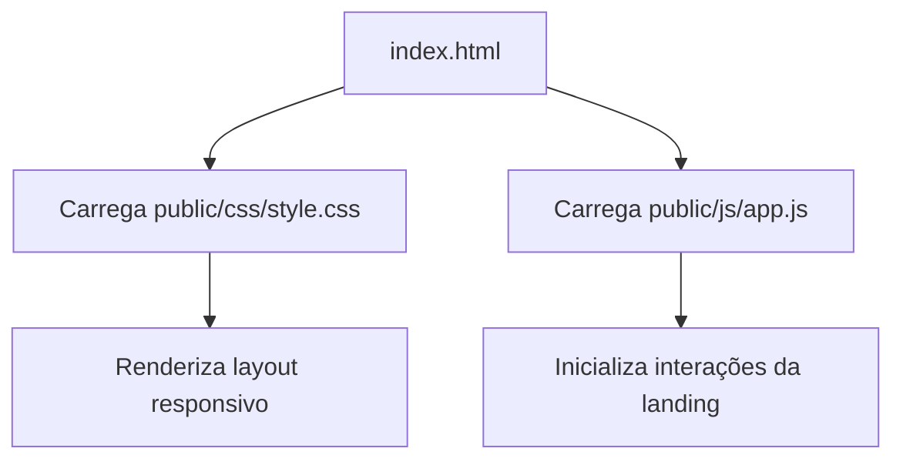

# Estrutura Organizacional do Projeto ALTTAB Esports

## 📋 Separação de Responsabilidades

### 🎯 **Landing Page (index.html + public/)**
- **Propósito:** Interface principal da organização ALTTAB Esports
- **Conteúdo:**
  - Apresentação dos serviços
  - Informações sobre campeonatos
  - Lives e transmissões
  - Formulário de contato
  - Time amador
- **Arquitetura:** Página única (`index.html`) consumindo estilos e scripts da pasta `public/`

### 🎮 **Dados do League of Legends (lol-data/)**
- **Propósito:** Assets oficiais do Riot Games
- **Conteúdo:**
  - Imagens de todos os campeões
  - Itens do jogo
  - Mapas e sprites
  - Dados estruturados do patch 15.19.1

### 🌐 **Arquivos Públicos (public/)**
- **Propósito:** Assets estáticos da landing page
- **Conteúdo:**
  - CSS principal (`public/css/style.css`)
  - JavaScript (`public/js/app.js`)
  - Imagens da marca ALTTAB
  - Ícones, favicons e vídeos

## 🔧 **Fluxo de Desenvolvimento**



## 📁 **Organização Detalhada**

### `/src/` - Arquivos Legados (em revisão)
```
src/
├── components/          # Componentes reutilizáveis (descontinuados)
├── data/                # Dados estruturados experimentais
└── utils/               # Scripts auxiliares em revisão
```

### `/public/` - Assets Estáticos
```
public/
├── css/
│   └── style.css       # Estilos principais e responsividade
├── js/
│   └── app.js          # JavaScript principal da landing page
├── images/
│   ├── logo-alttab.png # Logo da organização
│   ├── players/        # Fotos do time amador
│   ├── teams/          # Logos de parceiros/adversários
│   └── stream-*.jpg    # Imagens da seção de lives
├── icons/
│   └── favicon.ico     # Ícones e favicons
└── videos/
  └── lol-background.mp4 # Vídeo opcional do hero
```

### `/lol-data/` - Dados do League of Legends
```
lol-data/
├── champions/          # 168 imagens de campeões
│   ├── Yasuo.png
│   ├── Jinx.png
│   └── ...
├── items/              # Centenas de itens
│   ├── 3031.png        # Infinity Edge
│   ├── 3003.png        # Archangel's Staff
│   └── ...
├── maps/               # Mapas do jogo
├── sprites/            # Sprites combinados
└── 15.19.1/           # Dados completos do patch
    ├── data/           # JSONs com informações
    └── img/            # Todas as imagens originais
```

## 🔄 **Benefícios da Nova Estrutura**

### ✅ **Organização Clara**
- Ponto único de entrada em `index.html`
- Assets unificados em `public/`
- Conteúdo legado isolado em `src/`

### ✅ **Manutenibilidade**
- Estilos e scripts centralizados
- Atualizações rápidas na landing page
- Material legado disponível para futura refatoração

### ✅ **Performance**
- Assets otimizados por uso
- Carregamento sob demanda
- Cache eficiente

### ✅ **Reutilização**
- Componentes modulares
- Dados centralizados
- Utils compartilhados

## 🚀 **Próximos Passos**

1. **Componentização**
   - Dividir landing page em componentes
   - Sistema de roteamento simples
   - Carregamento dinâmico

2. **API Integration**
   - Conectar com API do Riot Games
   - Dados em tempo real
   - Cache inteligente

3. **Build System**
   - Automatização de tarefas
   - Minificação de assets
   - Deploy automatizado

4. **Testing**
   - Testes unitários
   - Testes de integração
   - Validação de acessibilidade